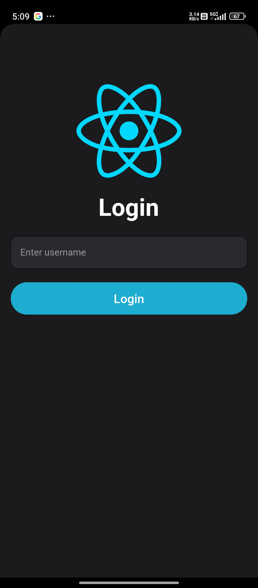
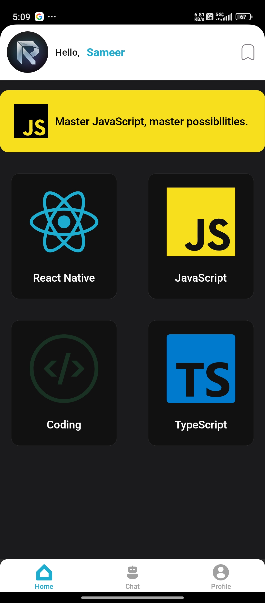
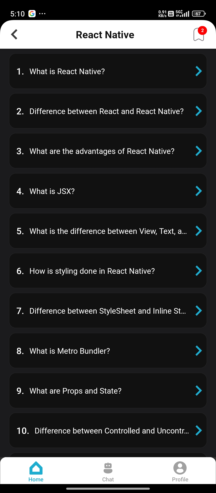
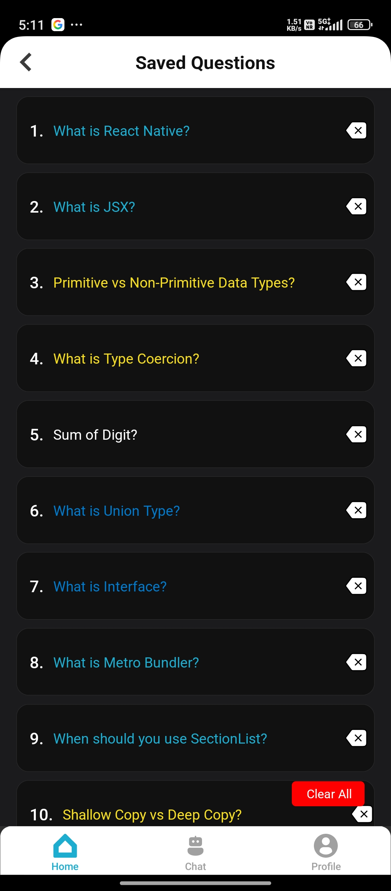
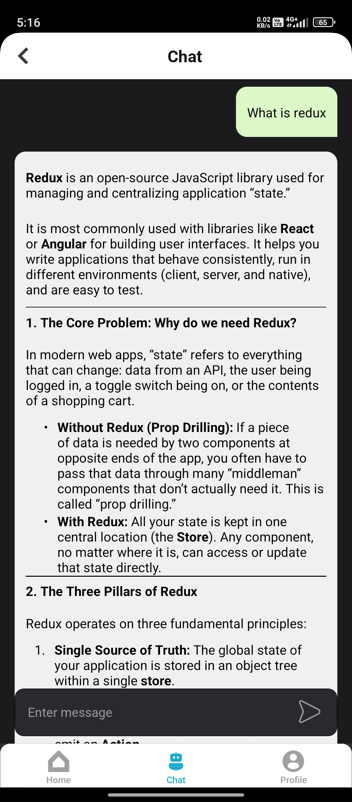
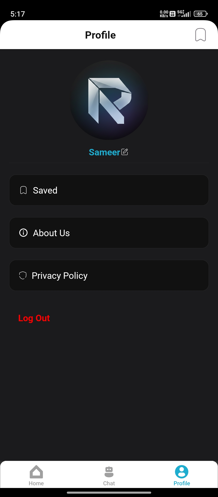
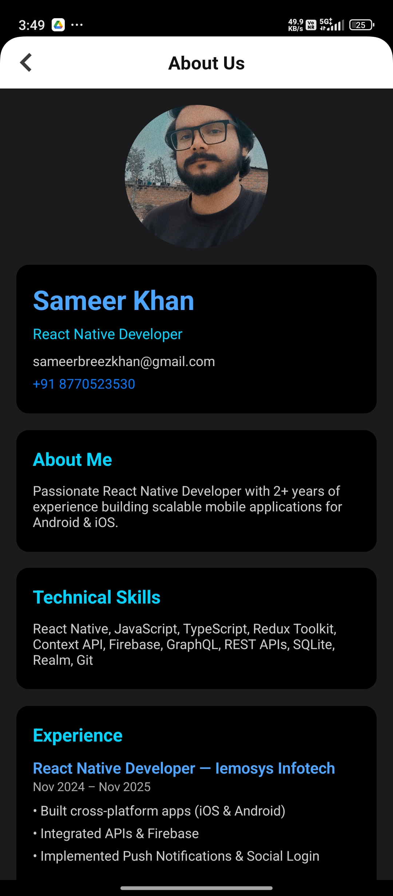

# 📱 RNPrep App

## 🚀 About the Project

RNPrep is a fast and lightweight React Native learning app designed to help developers prepare for technical interviews efficiently.

It provides curated questions on JavaScript, React Native, TypeScript, and basic coding concepts — along with an AI-powered chat for real-time doubt solving.

---

## ✨ Features

* 📚 Important interview questions (JavaScript, React Native, TypeScript, Coding)
* 🤖 Real-time AI chat using Firebase AI
* 💾 Save / Unsave questions (Redux state management)
* 📋 Saved questions screen for quick revision
* 👤 Profile management (edit username)
* 🔐 Login & logout using AsyncStorage
* ⚡ Clean and responsive UI

---

## 🛠 Tech Stack

* React Native CLI
* JavaScript (ES6+)
* Redux (State Management)
* Context API (Authentication)
* AsyncStorage (Local Storage)
* Firebase AI (Chat Integration)

---

## 📸 Screenshots

| Login                             | Home                            | List                            | Wishlist                                | Chat                            | Profile                               | About                             |
| --------------------------------- | ------------------------------- | ------------------------------- | --------------------------------------- | ------------------------------- | ------------------------------------- | --------------------------------- |
|  |  |  |  |  |  |  |


---

## 📦 APK Download

👉 [Download APK](https://drive.google.com/file/d/1iB6TJ08HfOSgeDRJ5FVi48hUaQ4kMU_b/view?usp=drive_link)

> ⚠️ Note: Enable **"Install from unknown sources"** on your device if prompted.

---

## ⚙️ Installation & Setup

```bash
# Clone the repository
git clone https://github.com/yourusername/rnprep-app.git

# Navigate to project folder
cd rnprep-app

# Install dependencies
npm install

# Run the app
npx react-native run-android
```

---

## 📂 Project Structure

```
/src
  /components
  /screens
  /navigation
  /redux
  /services
  /utils
  /assets
App.tsx
```

---

## 💡 Key Implementations

* Integrated Firebase AI for real-time chat functionality
* Implemented Redux for managing saved questions
* Used Context API for authentication flow
* Managed local user session using AsyncStorage

---

## 🎯 Future Improvements

* Add user authentication with backend
* Improve UI/UX with animations
* Add dark mode support

---

## 🔒 Note

This project is built for learning and portfolio purposes only.

---

## 👨‍💻 Author

**Sameer Khan**
React Native Developer

📧 [sameerbreezkhan@gmail.com](mailto:sameerbreezkhan@gmail.com)
📱 8770523530

---